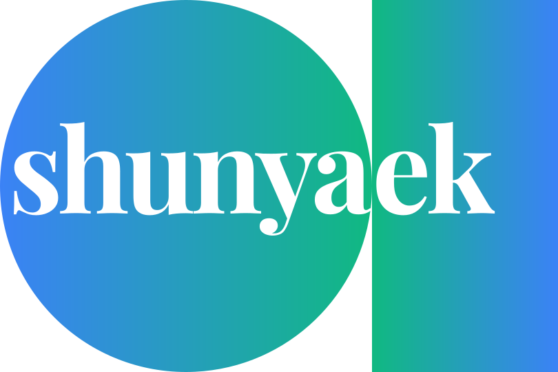

<html lang="en">
  <head>
    <link rel="stylesheet" href="./styles.css">
  </head>
<body>
  <main>
    <article class="halfwidthpane">
      <section class="logo">
        </img>
      </section>
      <section class="contact">
        <a target='_blank' href="https://wa.me/message/HDI26CHRSLLUP1">
          
💬

          +91 781 888 8887
        </a>
        <a target='_blank' href="mailto:hi@shunyaek.se">
          
✉️

          hi@shunyaek.se
        </a>
      </section>
    </article>
  </main>
</body>
</html>

<!--

**Here are some ideas to get you started:**

🙋‍♀️ A short introduction - what is your organization all about?
🌈 Contribution guidelines - how can the community get involved?
👩‍💻 Useful resources - where can the community find your docs? Is there anything else the community should know?
🍿 Fun facts - what does your team eat for breakfast?
🧙 Remember, you can do mighty things with the power of [Markdown](https://docs.github.com/github/writing-on-github/getting-started-with-writing-and-formatting-on-github/basic-writing-and-formatting-syntax)
-->
